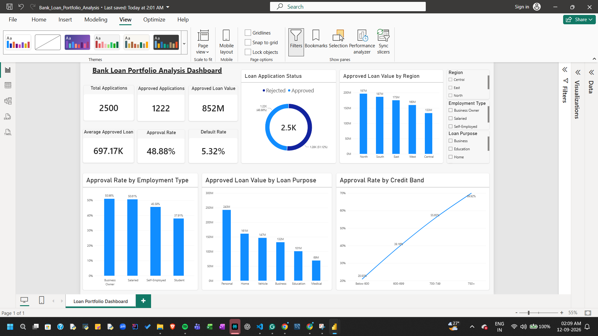

# Bank Loan Portfolio Analysis & Risk Insights

This project is a data analysis project where I explored a synthetic bank loan dataset using **Python, SQL, Excel, and Power BI**.

The main goal was to understand loan approval patterns, portfolio exposure, credit-score trends, and default risk, and then present the findings through an interactive Power BI dashboard.

## What I Worked On

In this project, I analyzed loan applications to understand:

- How loan approval rates vary across different groups
- How approved loan amounts are distributed across loan purposes and regions
- How credit scores relate to loan approval
- How employment type affects approval patterns
- Default rates among approved applications

## Tools Used

- **Python & Pandas** – Data cleaning and analysis
- **NumPy** – Numerical analysis
- **Matplotlib** – Data visualization
- **SQL** – Querying and analyzing the loan data
- **Microsoft Excel** – Data analysis and KPI review
- **Power BI** – Building the interactive dashboard

## Dataset

The dataset contains **2,500 synthetic loan applications**.

Some of the important fields include:

- Age
- Employment Type
- Annual Income
- Credit Score
- Loan Purpose
- Loan Amount
- Loan Term
- Existing Loans
- Debt-to-Income Ratio
- Interest Rate
- Region
- Loan Status
- Default Flag

> **Note:** The dataset is completely synthetic and does not contain real customer or bank data.

## Key Numbers

| Metric | Value |
|---|---:|
| Total Applications | 2,500 |
| Approved Applications | 1,222 |
| Approval Rate | 48.88% |
| Approved Loan Value | 852M |
| Average Approved Loan | 697.17K |
| Default Rate | 5.32% |

## Power BI Dashboard

I built an interactive Power BI dashboard to make the analysis easier to explore.

The dashboard includes:

- Overall loan application KPIs
- Loan application status
- Approval rate by employment type
- Approved loan value by loan purpose
- Approval rate by credit-score band
- Approved loan value by region
- Filters for Region, Employment Type, and Loan Purpose

### Dashboard Preview



## SQL Analysis

I used SQL to explore the dataset and calculate metrics such as:

- Overall application and approval statistics
- Approval rate by employment type
- Approval rate by loan purpose
- Approval rate across credit-score bands
- Default rate among approved applications

The SQL queries are available in:

`sql/loan_analysis.sql`

## Python Analysis

I used Python and Pandas to work with the dataset and explore different loan and risk-related patterns.

The analysis includes:

- Loading and working with the loan dataset
- Data manipulation and exploration
- Analysis of approval patterns
- Comparison of credit-score and employment segments
- Analysis of loan amounts and risk indicators

The notebook is available in:

`notebooks/bank_loan_analysis.ipynb`

## Excel Analysis

I also included an Excel workbook containing the loan data and supporting analysis:

`Bank_Loan_Analysis.xlsx`

## Project Structure

```text
bank-loan-portfolio-analysis/
│
├── data/
│   └── loan_data.csv
│
├── notebooks/
│   └── bank_loan_analysis.ipynb
│
├── powerbi/
│   ├── Bank_Loan_Portfolio_Analysis.pbix
│   ├── PowerBI_Dashboard_Guide.md
│   └── bank_loan_dashboard.png
│
├── reports/
│   └── key_findings.md
│
├── sql/
│   └── loan_analysis.sql
│
├── Bank_Loan_Analysis.xlsx
├── README.md
└── requirements.txt


## Disclaimer

This project was created for educational and portfolio purposes. All loan records and financial values are synthetic and do not represent real customer or bank data.
